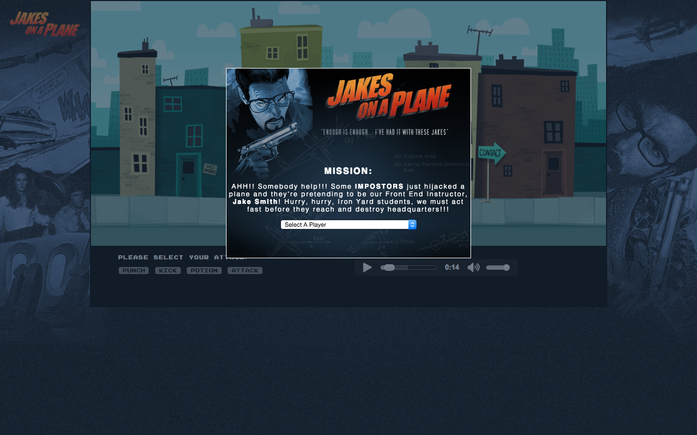

#5.4-turn-based-game - "Jakes On A Plane"

"Jakes On A Plane" was my first collaborative project (working alongside Aaron Emery & J Scott Chapman). The idea of the project was to build a Final Fantasy style turn based game. So we decided to create a game based on a layer of "inside" jokes related to our Iron Yard instructor, Jake Smith, and married it with the movie "Snakes On A Plane" (hence, the name). I was largely responsible for the design, doing a good bit of the graphics myself, while my peers worked effortlessly on functionality. We had a total of four days to complete it. This was also our first experience using GitHub to merge multiple pull requests. 

